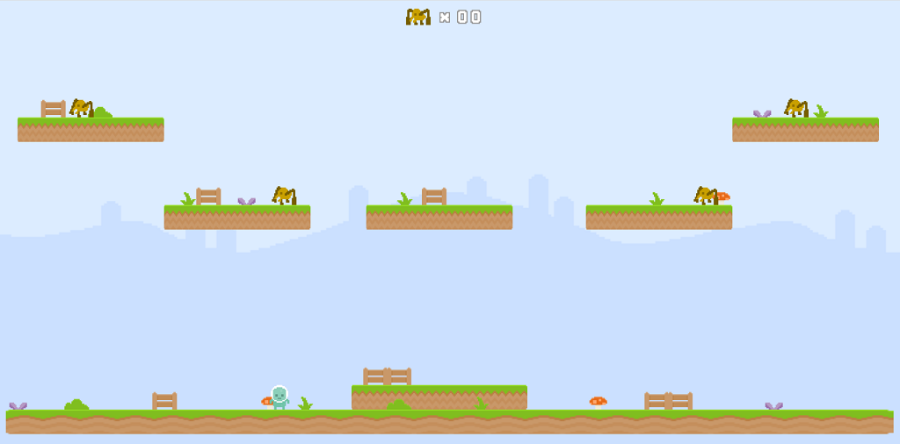

# Javascript Game
----------------------------------

## Javascript와 mozilla 게임 연습 에셋들을 이용하여 간단한 게임을 작업했다.
#### https://mozdevs.github.io/html5-games-workshop/en/guides/platformer/start-here/ 
#### 해당 사이트의 게임 방법을 참고하여 제작했다. 또한, Phaser.js는 사용하지 않았다.
----------------------------------
#### 게임 플레이 영상
https://www.youtube.com/watch?v=7txepGf0-Ps
----------------------------------
1. 점수판: 거미를 잡으면 점수 증가
2. 영웅(히어로): 좌우 이동에 맞는 스프라이트와 점프 스프라이트 표시
3. 거미(몬스터): 좌우 이동 시 맞는 스프라이트 표시
4. 영웅: 거미에게 좌우 방향에서 닿으면 게임 재시작, 사망 스프라이트 표시
5. 거미: 영웅에게 위쪽 방향에서 닿으면 사망, 사망 스프라이트 표시
6. 단계: 1 단계와 2 단계로 제작, 2 단계가 끝나면 다시 1 단계로
----------------------------------
### 게임 제작 이유
> javascript의 활용성 알고 javascript 문법을 공부, 그리고 javascript를 이용한 간단한 게임 로직 공부
----------------------------------
### 게임 실행 환경과 분할된 코드 설명
> localhost에서 실행 했다. 
> assets/: 이미지, levels/: 지형 및 캐릭터 초기 설정, Objects/: 플레이어(영웅)과 거미(몬스터), 점수판
----------------------------------